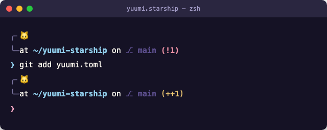

# 🐱 yuumi.starship

A pastel [Starship](https://starship.rs) prompt theme inspired by **Yuumi**, the Magical Cat from League of Legends — lavender fur, sky-blue eyes, and gold magic.

Fan-made palette. Not affiliated with or endorsed by Riot Games.

## Palette

| Name  | Hex       | Used for                          |                                                                        |
| ----- | --------- | ---------------------------------- | ---------------------------------------------------------------------- |
| iris  | `#a6a0de` | OS icon, jobs                      |  |
| foam  | `#8fcbe8` | current directory, success symbol  |  |
| rose  | `#f5a9c5` | language & tool badges (python, node, docker...) |  |
| gold  | `#efc873` | staged files, custom env           |  |
| pine  | `#5b4e8c` | git branch                         |  |
| love  | `#e88fa3` | git status, error symbol           |  |
| text  | `#f7f3ea` | base text                          |  |
| muted | `#7a749e` | frame brackets                     |  |

## Preview

_Add a screenshot of your terminal here — drop a `preview.png` in this folder and it'll show up when you link it below:_

```md

```

## Install

1. Copy `yuumi.toml` to your Starship config location:
   ```bash
   cp yuumi.toml ~/.config/starship.toml
   ```
2. Make sure Starship is initialized in your shell rc (`~/.zshrc` or `~/.bashrc`):
   ```bash
   eval "$(starship init zsh)"
   ```
3. Reload your shell:
   ```bash
   exec zsh
   ```

You'll need a [Nerd Font](https://www.nerdfonts.com) installed and set as your terminal font for the icons to render correctly.

### Try it without overwriting your current config

```bash
STARSHIP_CONFIG=/path/to/yuumi.toml starship prompt
```

## License

MIT
